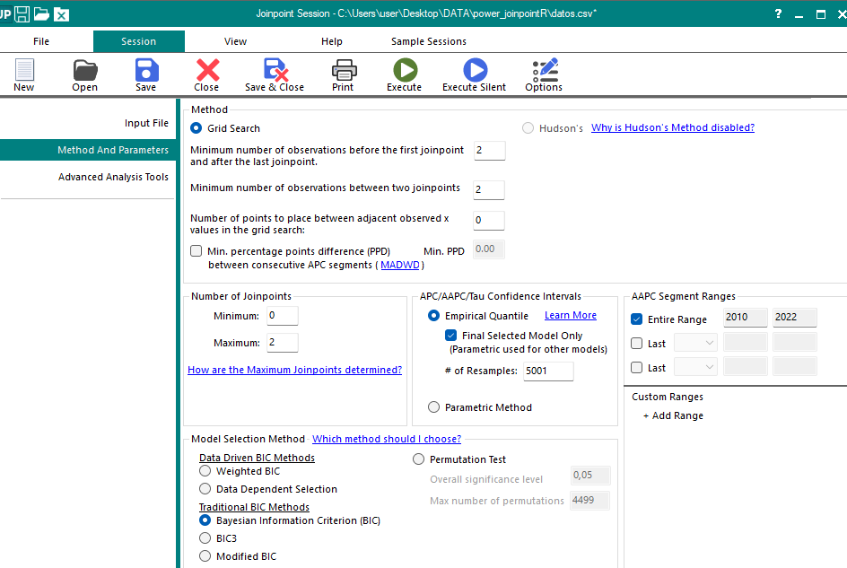
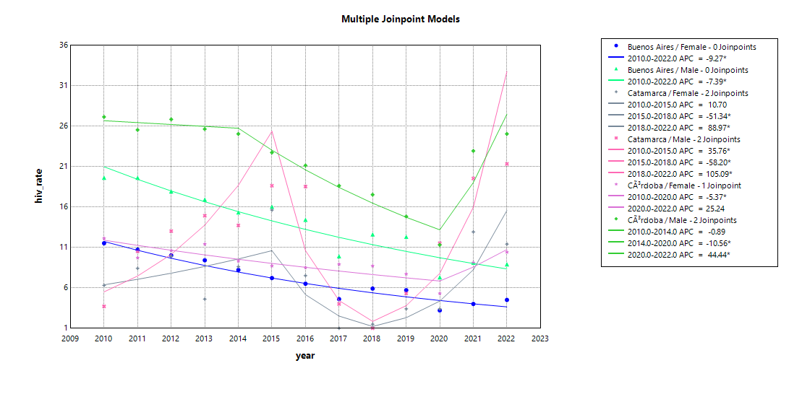

```{r}
#| id: Configuración global
#| echo: false
#| message: false
#| warning: false
knitr::opts_chunk$set(
  echo = TRUE,
  message = FALSE,
  warnings = FALSE,
  fig.align = "center",
  out.width = "100%",
  fig.width = 12,
  fig.height = 6,
  dpi = 300
)
```

```{r}
#| id: Cargar paquetes
#| include: false
#| echo: false
# remotes::install_github("https://github.com/datos-ine/joinpointR")
pacman::p_load(
  ggridges,
  joinpointR,
  flextable,
  scales,
  here,
  rio,
  janitor,
  tidyverse
)

# ---- Formato tablas ----
tab_format <- function(x) {
  x |>
    flextable() |>
    fontsize(size = 16, part = "all") |>
    bg(bg = "#2F2E4E", part = "header") |>
    color(color = "white", part = "header") |>
    valign(valign = "top") |>
    autofit()
}
```

## Introducción

- Las regresiones joinpoint son modelos de regresión lineal segmentada que permiten identificar cambios en la tendencia de una serie temporal.

- En Epidemiología, se utilizan para analizar la evolución de indicadores poblacionales e identificar períodos con diferentes tendencias.

- El Joinpoint Regression Program [@joinpoint], es la herramienta de referencia para ajustar estos modelos.

## Introducción

- En el ecosistema de `R` existen algunos paquetes como `segmented` [@segmented] y `ljr` [@ljr] que permiten ajustar regresiones segmentadas.

- Sin embargo, no existe ningún paquete que permita realizar un análisis completo, replicando el procedimiento de Joinpoint Regression Program.

## Objetivos

- Desarrollar un paquete de R que permita analizar tendencias temporales mediante regresiones joinpoint utilizando herramientas del ecosistema `tidyverse`, integrándose a flujos de trabajo reproducibles.

## Materiales y métodos

- `joinpointR` ajusta modelos de regresión lineal segmentada usando el método de *grid-search*.

- Transformación logarítmica de la variable respuesta (log-tasa).

- Selección del mejor modelo por Criterio de Información Bayesiano (BIC), BIC penalizado (BIC3) o BIC ponderado (WBIC).

- Permite especificar hasta dos variables de agrupamiento y un máximo de 7 joinpoints.

## Funcionalidades

- El paquete incorpora funciones para:
  - Estimar el BIC, BIC3 y WBIC de un modelo o lista de modelos.
  - Estimar el cambio porcentual anual (APC) y cambio porcentual anual promedio (AAPC) y sus intervalos de confianza (IC).
  - Generar tablas de resumen y visualizar los resultados en `ggplot2`.

## Flujo de trabajo

```{dot}
digraph g{
    node[
        shape=square, 
        fontname="Calibri",
        style="filled",
        fillcolor="#9274b38f"
        ]

    data[label="Dataset"] 

    model_jp[label="model_jp() \n model_jp_grid()"]

    bic_jp[label="bic_jp()"]

    get_summary[label="get_summary() \n summary() \n get_apc() \n get_aapc()"]
    
    gg_jpoint[label="gg_jpoint() \n gg_jpoint_line() \n gg_jpoint_area()"]

    fun_gg[label="plot_cbpal() \n scale_cbpal() \n scale_cbpal_color() \n scale_cbpal_colour() \n scale_cbpal_fill()",
        color="none",
        fillcolor="#CBE7E5CC",
        fontsize=12
        ]

    fun[
        label="clean_jp_data() \n calc_bic_jp()",
        color="none",
        fillcolor="#CBE7E5CC",
        fontsize=12
        ]

    data -> model_jp -> {bic_jp get_summary gg_jpoint}

    model_jp -> fun [label="Funciones \n internas", fontname="Calibri"]

    gg_jpoint -> fun_gg [label="Funciones \n auxiliares", fontname="Calibri"]

    
    { rank=same; model_jp fun};

    { rank=same; gg_jpoint fun_gg};


}
```

## `model_jp()` / `model_jp_grid()`

- Ajusta modelos de regresión joinpoint.

::: fragment
```{r}
#| id: model_jp
# Valores por defecto
args(model_jp)
```
:::

- Internamente, utiliza `clean_jp_data()` para preparar los datos y `calc_bic_jp()` para calcular los criterios de selección BIC, BIC3 y WBIC.

## `update.model_jp()`/`update()`

- Permite actualizar los argumentos de un modelo o lista de modelos.

::: fragment
```{r}
#| eval: false
#| id: update
models <- model_jp(data, rate, time, group)

models2 <- update(models, k = 3, method = "wbic")
```
:::

## `bic_jp()`

- Valores de BIC, BIC3, WBIC para los modelos ajustados.

::: fragment
```{r}
#| eval: false
#| echo: true
#| id: bic_jp
models <- model_jp(data, rate, time, group)

# BIC lista completa de modelos
bic_jp(models)

# BIC modelo individual
bic_jp(models[1])
```
:::

## `get_summary()`, `get_apc()`, `get_aapc()`

- Medidas de resumen para los modelos ajustados.

::: fragment
```{r}
#| id: get_summary

args(get_summary)

args(get_apc)

args(get_aapc)
```
:::

## 

- Se puede usar `summary()`como función *wrapper*.

- Permite ajustar el nivel de confianza, ocultar el IC o las estrellas de significancia.

- Exportar salida como objeto `flextable` usando el argumento `as.ft = TRUE`.

## `gg_jpoint()`, `gg_jpoint_line()`, `gg_jpoint_area()`

- Visualización de resultados en `ggplot2`.

::: fragment
```{r}
#| id: gg_jpoint

args(gg_jpoint)

args(gg_jpoint_line)

args(gg_jpoint_area)
```
:::

## Comparación con Joinpoint Regression Software

- Dataset de ejemplo `hiv_data`: tasas de HIV en Argentina por sexo y jurisdicción 2010-2022 (Datos Abiertos Argentina, https://datos.gob.ar/).

::: fragment
```{r}
#| id: ej-1
names(hiv_data)

# Crear dataset de ejemplo
datos <- hiv_data |>
  filter_out(sex == "Both sexes") |>
  filter(admin %in% c("Buenos Aires", "Córdoba", "Catamarca"))


# Guardar dataset para Joinpoint Regression Software
datos |>
  arrange(admin, sex) |>
  export("datos.csv")
```
:::

## 

{fig-align="center"}

## 

```{r}
#| id: ej-2
#| message: true
# Ajustar modelos con argumentos por defecto
mods <- model_jp(
  data = datos,
  rate = hiv_rate,
  time = year,
  group = c("admin", "sex")
)
```

##

```{r}
#|id: ej-3
bic_jp(mods)
```

## 

```{r}
#| echo: false
#| id: jp2
#| tbl-cap: "Joinpoint Regression Software: Selección del mejor modelo"
# Datos para la tabla
dat <- read_delim("datos.Export.Model.Selection.txt") |>
  clean_names() |>
  tab_format() |>
  hline() |>
  merge_v(j = 1:2, combine = TRUE) |>
  bg(j = 3:9, i = c(1, 4, 9, 12, 14, 18), bg = "#9274b38f") |>
  autofit()

# Mostrar tabla
dat
```

## 
```{r}
#| id: ej-4
# Tabla resumen
get_summary(mods, as.ft = TRUE)
```

## 

```{r}
#| echo: false
#| id: jp3
#| tbl-cap: "Joinpoint Regression Software: APC"
# Datos para la tabla
dat <- read_delim("datos.Export.APC.txt") |>
  clean_names() |>
  mutate(apc_significant = if_else(apc_significant == 1, "*", "")) |>
  tab_format() |>
  merge_v(j = 1) |>
  merge_v(j = 2:3, combine = TRUE) |>
  colformat_double(j = 3:6, big.mark = "", decimal.mark = ",", digits = 0) |>
  colformat_double(j = 9:10, big.mark = "", decimal.mark = ",", digits = 2) |>
  colformat_double(j = 11, big.mark = "", decimal.mark = ",", digits = 3)

dat
```
## 

```{r}
#| echo: false
#| id: jp4
#| tbl-cap: "Joinpoint Regression Software: AAPC"
# Datos para la tabla
dat <- read_delim("datos.Export.AAPC.txt") |>
  select(-10, -11) |>
  clean_names() |>
  tab_format() |>
  merge_v(j = 1) |>
  colformat_double(j = 5:6, big.mark = "", decimal.mark = ",", digits = 0) |>
  colformat_double(j = "p_value", big.mark = "", decimal.mark = ",", digits = 3)

dat
```

## 

```{r}
#| id: ej-5
#| fig-cap: "Selección de paletas colorblind-friendly"
# Explorar paletas
plot_cbpal(type = "div")
```

## 

```{r}
#| id: ej-6
#| fig-cap: "Gráfico por defecto"
gg_jpoint(mods, facets = "grid")
```

## 
{fig-align="center"}


## 
```{r}
#| id: ej-7
#| fig-cap: "Cambiar color según tendencia"
gg_jpoint(mods, facets = "grid", color.by = "trend") +
  scale_cbpal(palette = "cassatt2")
```

## Discusión

- Los modelos seleccionados por `model_jp()`coinciden con los resultados de Joinpoint Regression Software.

- Se observan diferencias en los IC del APC y AAPC ya que el método para estimarlos difiere (paramétrico vs. simulaciones).

- El paquete `joinpointR` constituye una alternativa de código abierto para el análisis de tendencias temporales, contribuye a la reproducibilidad y transparencia de los resultados y resulta de utilidad para la investigación epidemiológica.


## Muchas gracias!!!

::::: columns
::: {.column width="60%"}
💬 **Preguntas o comentarios**

📧 *tamararicardo83\@gmail.com*

🏛️ Instituto Nacional de Epidemiología "Dr. Juan H. Jara", Mar del Plata, Argentina
:::

::: {.column width="40%"}
{fig-align="center"}
:::
:::::


## Referencias


::: {references}
:::
